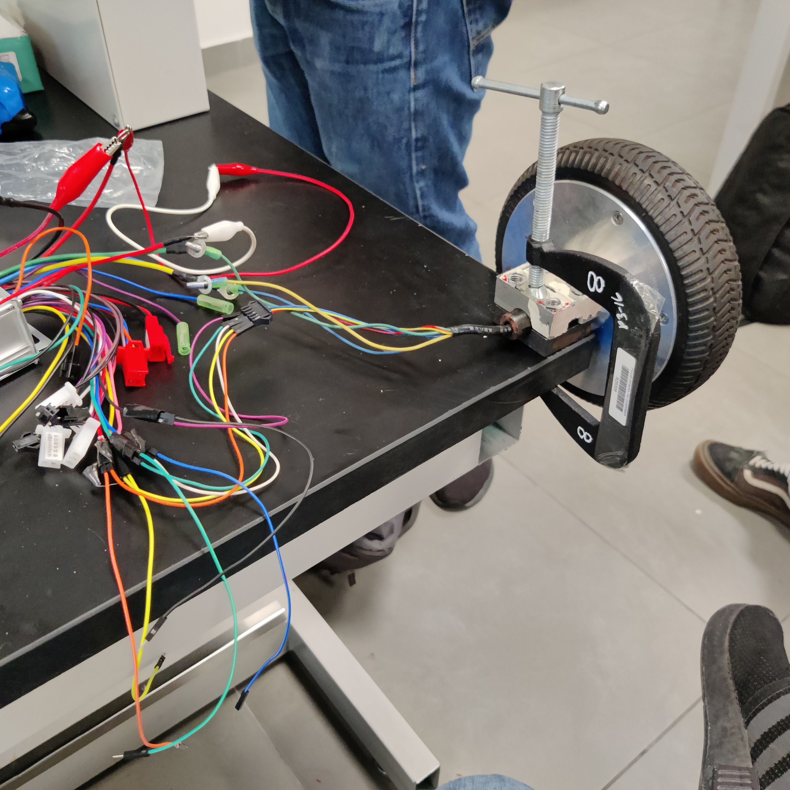
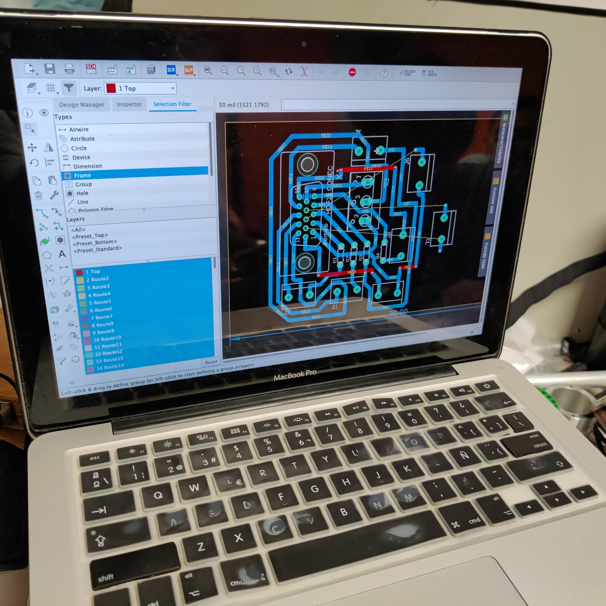
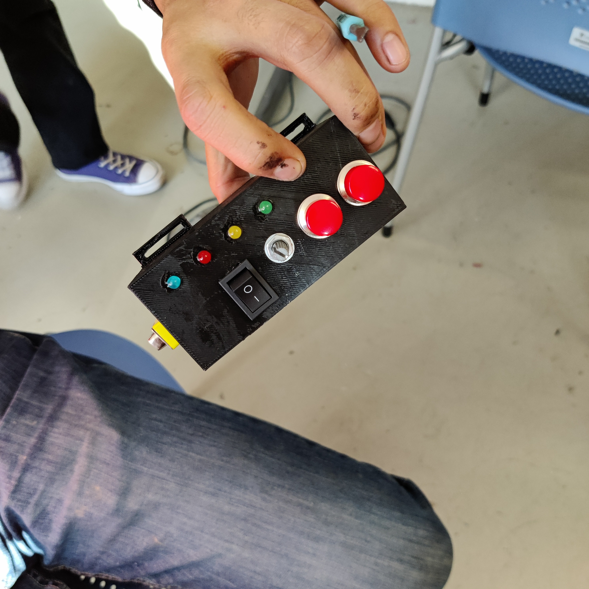
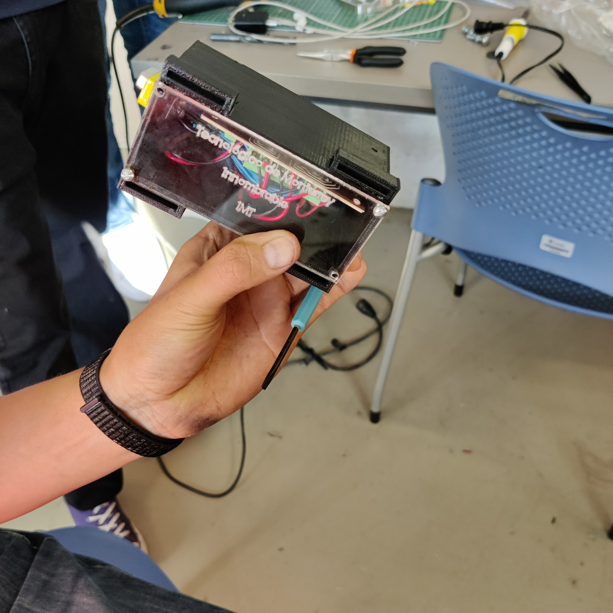
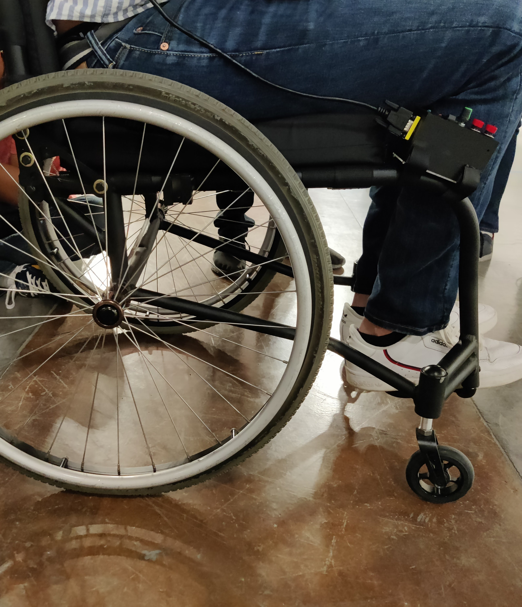
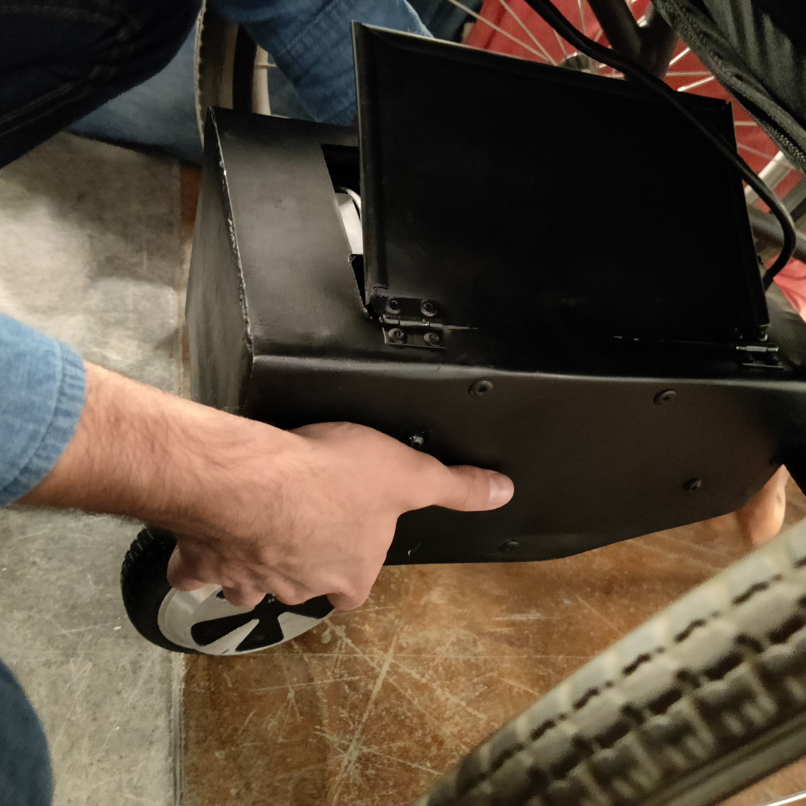
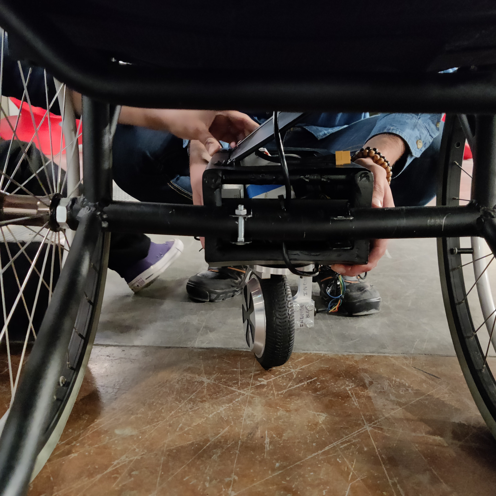
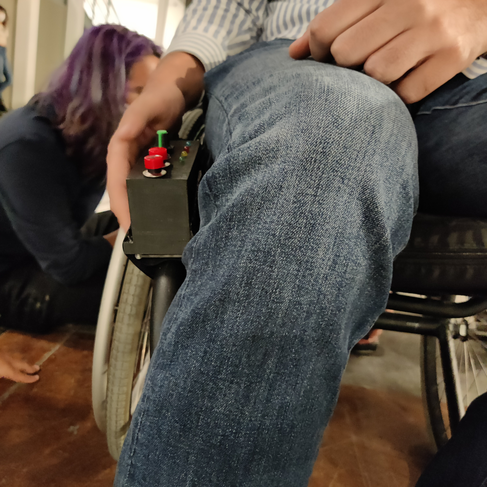

# Fifth-Wheel

The equipment used for this project consist of an electric scooter brushless motor wheel, a motorbike driver, A 24 volt rechargeable battery, LEDs, a potentiometer, a switch, buttons, two inductive sensors, PLA filament for 3D printing, steel tubes and sheets, aluminum plates, a set of bearings and a microcontroller (KL25Z). 

The design consist of making an intergraded attachment that holds its battery, motor driver, electric scooter wheel, PCB and control panel in one place. The previous, so that the attachment can be transferable between different standard wheelchairs. The wheelchair has two modes of operation, automatic and manual. The automatic mode consist of receiving a reference desired velocity input by the user’s stroke on the wheels. When the user stokes on the wheels, a refence maximum velocity is detected and by the system and it keeps advancing at this constant speed unless the user accelerates by stoking the wheels again or deaccelerates by stopping the wheels as one normally would; This is possible first because the brushless motor does not oppose movement even if its energized, and two because motor has a built in encoder that reads the motor’s frequency which can later be used as part of the microcontrollers input. The manual mode is much simpler, for it only responds to the knob installed in the control panel. 

My main role in this project was to program the microcontroller (KL25Z) to establish the motor’s velocity according to the user’s input (via a potentiometer or via the velocity logged into the system by the user’s stroke on the main wheels; the election between the two types of input is determined via a button) and receive data from a set of sensors (accelerometer, inductive sensors, encoder, temperature sensor, potentiometer, 2 buttons) to detect if the user is on a ramp and grant additional acceleration; to identify if the wheel is an undesirable angle to allow smooth traveling; to monitor the battery life of the whole system; and to measure the motor driver’s temperature. Additionally programmed a set of actuators (LEDs, motor itself) to ensure the user is notified of any safety hazards and the system does not operate while under dangerous parameters. Protocols used include IC2 and UART. My second role was the design of the user’s control panel as well as the 3D printing process.  

# Linked videos
[Fifth Wheel functionality](https://youtu.be/RnXhuDlJasQ)

# Images

.jpg)

.jpg)

.jpg)

.jpg)

.jpg)

